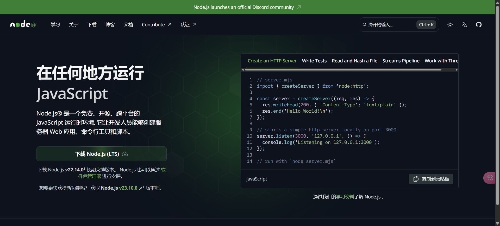
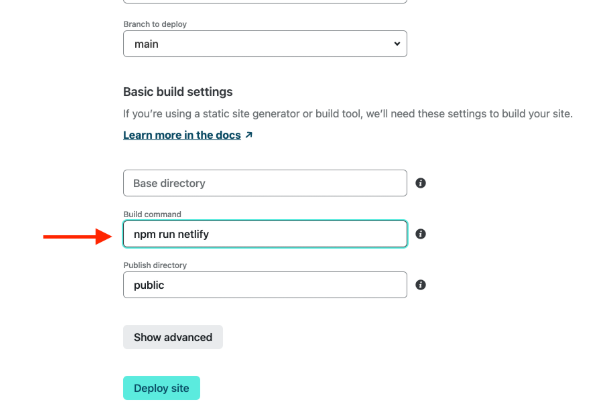
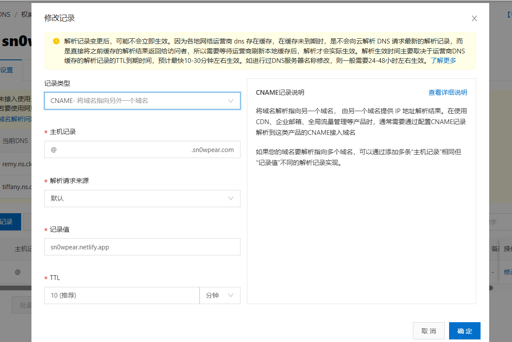
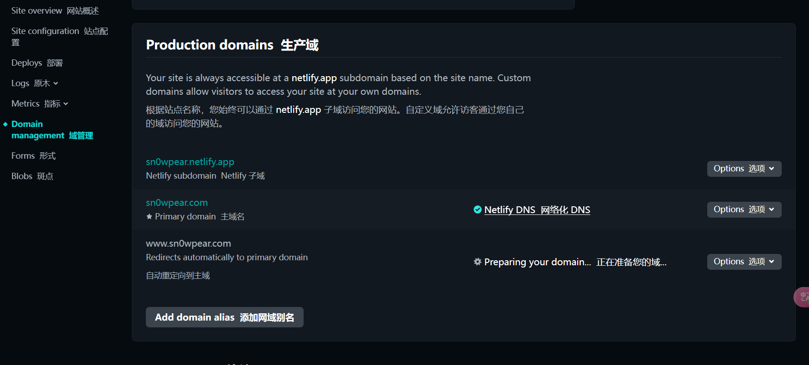

## 搭建的基础原理

搭建简单的个人博客主要是有四个内容：

博客生成框架；代码托管平台；站点部署服务；访问加速服务

### 博客生成框架

这个是一个应用程序，它帮助我们把我们的博客复杂的前端后端代码给简化，让我们可以用简单的手段输入一些内容来实现复杂的网站搭建，帮助我们减少编写：html，css，js这三件套。这三件套才是网站的文件核心架构，但是我们自己从新编写太麻烦了，于是我们可以用生成框架减轻负担。

准备使用的是hexo。

### 代码托管平台

对于我们自己的网站代码和文件，也就是上面说的三件套，我们需要一个平台来托管代码， 文件托管平台是一种在线服务平台，主要提供文件存储、共享和管理等功能 。简单来说就是在网络的某一个地方来存放我们的代码——博客文件目录。

准备使用github

### 站点部署服务

将形成的网站部署到互联网上，让他人可以访问你的网站。常见的就是github-pages，但是由于对国内访问太慢了，于是我们采用netlify来作为本次实验的使用平台。同时，netlify不止支持静态的网站部署，也可以自定义网站的脚本。 

```python
npm run是在使用 Node.js 和 npm（Node Package Manager）进行项目开发时常用的命令，主要用于执行 package.json 文件中 scripts 字段所定义的脚本命令。 
#功能用途：
#在项目开发过程中，有许多重复性的任务，例如启动开发服务器、运行测试、构建项目等。借助 package.json 的 scripts 字段来定义脚本，就能使用 npm run 命令轻松执行这些任务，避免每次都输入复杂的命令。
```

### 访问加速服务

 访问加速服务是一种通过优化网络传输、缓存数据等技术手段，来提高用户访问网络资源速度和效率的服务。 原理是CDN加速

准备使用cloudflare

## 开始搭建

### 博客生成框架

#### 前置环境

首先要有node.js的环境，我们去官方网站下载，windos直接用下载包就可以了



然后再终端看看版本：

```shell
nod -v
npm -v
#这句可能出现问题
查看当前脚本执行策略
在以管理员身份打开的 PowerShell 中，运行以下命令：
Get-ExecutionPolicy
通常会返回 “Restricted”，表示当前策略禁止运行脚本。
修改脚本执行策略
运行以下命令，将执行策略更改为 “RemoteSigned”：
Set-ExecutionPolicy RemoteSigned -Scope CurrentUser
这条命令会将当前用户的脚本执行策略设置为 “RemoteSigned”，表示允许运行本地编写的脚本以及经过签名的远程脚本。运行后，会提示你确认操作，输入 “Y” 并回车确认。
#
#这样之后就可以查看了
```

然后去安装hexo：

```shell
npm install hexo-cli -g # 全局安装hexo命令行工具
#其中-g参数表示全局安装，没有这个参数就只在当前目录下安装，建议全局安装。
#在 Windows 系统下，全局安装的 npm 包默认会存放在 %AppData%\npm\node_modules 目录中。你可以通过以下步骤找到该目录：
#按下 Win + R 组合键，打开 “运行” 对话框。
#输入 %AppData% 并回车，会打开当前用户的应用数据文件夹。
#在该文件夹中找到 npm 文件夹，进入后即可看到 node_modules 文件夹，全局安装的包就存放在这里。
```

然后初始化hexo的框架

```shell
hexo init "你的博客目录名称" # 目录名称不含空格的时候双引号可以省略
cd "博客目录" #去博客目录底下
```

安装博客需要的其他支持：

```shell
npm install # 安装的依赖项在package.json文件的dependencies字段中可以看到
```

查看目录结构：

```shell
tree -L 1
```

结果如下：

- ps：

- 可能没能使用tree，那是因为你的这个功能没有安装：

	```shell
	安装 Chocolatey
	以管理员身份打开 PowerShell，然后运行以下命令：
	powershell
	Set-ExecutionPolicy Bypass -Scope Process -Force; [System.Net.ServicePointManager]::SecurityProtocol = [System.Net.ServicePointManager]::SecurityProtocol -bor 3072; iex ((New-Object System.Net.WebClient).DownloadString('https://community.chocolatey.org/install.ps1'))
	
	#安装 tree
	#安装好 Chocolatey 之后，在 PowerShell 中运行下面的命令来安装 tree：
	powershell
	choco install tree
	
	#安装完成后，重新打开 Git Bash，就可以使用 tree 命令了。
	```


```bash
.├── _config.landscape.yml
├── _config.yml
├── node_modules
├── package-lock.json
├── package.json
├── scaffolds
├── source
└── themes
```

- ```
	_config.yml
	```

	为全局配置文件，网站的很多信息都在这里配置，比如说网站名称，副标题，描述，作者，语言，主题等等。具体可以参考官方文档：https://hexo.io/zh-cn/docs/configuration.html。

- ```
	scaffolds
	```

	骨架文件，是生成新页面或者新博客的模版。可以根据需求编辑，当`hexo`生成新博客的时候，会用这里面的模版进行初始化。

- ```
	source
	```

	这个文件夹下面存放的是网站的`markdown`源文件，里面有一个`_post`文件夹，所有的`.md`博客文件都会存放在这个文件夹下。现在，你应该能看到里面有一个`hello-world.md`文件。

- ```
	themes
	```

	网站主题目录，`hexo`有非常丰富的主题支持，主题目录会存放在这个目录下面。
	
	我们后续会以默认主题来演示，更多的主题参见：https://hexo.io/themes/

#### 简单操作：

```bash
hexo new post "test" # 会在 source/_posts/ 目录下生成文件 ‘test.md’，打开编辑
hexo generate        # 生成静态HTML文件到 /public 文件夹中
hexo server          # 本地运行server服务预览，打开 http://localhost:4000 即可预览你的博客
```

 为了后续`netlify`建站方便，我们可以在`package.json`里面添加一个命令： 

```js
{
    // ......
    "scripts": {
        "build": "hexo generate",
        "clean": "hexo clean",
        "deploy": "hexo deploy",
        "server": "hexo server",
        "netlify": "npm run clean && npm run build" // 这一行为新加
    },
    // ......
}
```

由于我们这个教程的重点不是如何编写自己的博客，而是怎么把博客搭建起来，所以`hexo`的细节用法以及各种主题的设置我们就不展开细说了，官网有非常详细的文档和教程可供参考。这里简单提一下`_config.yml`的各个字段的含义：

```python
# Site
title: Hexo  # 网站标题
subtitle:    # 网站副标题
description: # 网站描述
author: John Doe  # 作者
language:    # 语言
timezone:    # 网站时区, Hexo默认使用您电脑的时区

# URL
## If your site is put in a subdirectory, set url as 'http://yoursite.com/child'
## and root as '/child/'
url: http://yoursite.com   # 你的站点Url
root: /                    # 站点的根目录
permalink: :year/:month/:day/:title/   # 文章的 永久链接 格式   
permalink_defaults:        # 永久链接中各部分的默认值

# Directory   
source_dir: source     # 资源文件夹，这个文件夹用来存放内容
public_dir: public     # 公共文件夹，这个文件夹用于存放生成的站点文件。
tag_dir: tags          # 标签文件夹     
archive_dir: archives  # 归档文件夹
category_dir: categories     # 分类文件夹
code_dir: downloads/code     # Include code 文件夹
i18n_dir: :lang              # 国际化（i18n）文件夹
skip_render:                 # 跳过指定文件的渲染，您可使用 glob 表达式来匹配路径。    

# Writing
new_post_name: :title.md  # 新文章的文件名称
default_layout: post      # 预设布局
titlecase: false          # 把标题转换为 title case
external_link: true       # 在新标签中打开链接
filename_case: 0          # 把文件名称转换为 (1) 小写或 (2) 大写
render_drafts: false      # 是否显示草稿
post_asset_folder: false  # 是否启动 Asset 文件夹
relative_link: false      # 把链接改为与根目录的相对位址    
future: true              # 显示未来的文章
highlight:                # 内容中代码块的设置    
  enable: true            # 开启代码块高亮
  line_number: true       # 显示行数
  auto_detect: false      # 如果未指定语言，则启用自动检测
  tab_replace:            # 用 n 个空格替换 tabs；如果值为空，则不会替换 tabs

# Category & Tag
default_category: uncategorized
category_map:       # 分类别名
tag_map:            # 标签别名

# Date / Time format
## Hexo uses Moment.js to parse and display date
## You can customize the date format as defined in
## http://momentjs.com/docs/#/displaying/format/
date_format: YYYY-MM-DD     # 日期格式
time_format: HH:mm:ss       # 时间格式    

# Pagination
## Set per_page to 0 to disable pagination
per_page: 10           # 分页数量
pagination_dir: page   # 分页目录

# Extensions
## Plugins: https://hexo.io/plugins/
## Themes: https://hexo.io/themes/
theme: landscape   # 主题名称

# Deployment
## Docs: https://hexo.io/docs/deployment.html
#  部署部分的设置
deploy:     
  type: '' # 类型，常用的git yml# Sitetitle: Hexo  # 网站标题subtitle:    # 网站副标题description: # 网站描述author: John Doe  # 作者language:    # 语言timezone:    # 网站时区, Hexo默认使用您电脑的时区# URL## If your site is put in a subdirectory, set url as 'http://yoursite.com/child'## and root as '/child/'url: http://yoursite.com   # 你的站点Urlroot: /                    # 站点的根目录permalink: :year/:month/:day/:title/   # 文章的 永久链接 格式   permalink_defaults:        # 永久链接中各部分的默认值# Directory   source_dir: source     # 资源文件夹，这个文件夹用来存放内容public_dir: public     # 公共文件夹，这个文件夹用于存放生成的站点文件。tag_dir: tags          # 标签文件夹     archive_dir: archives  # 归档文件夹category_dir: categories     # 分类文件夹code_dir: downloads/code     # Include code 文件夹i18n_dir: :lang              # 国际化（i18n）文件夹skip_render:                 # 跳过指定文件的渲染，您可使用 glob 表达式来匹配路径。    # Writingnew_post_name: :title.md  # 新文章的文件名称default_layout: post      # 预设布局titlecase: false          # 把标题转换为 title caseexternal_link: true       # 在新标签中打开链接filename_case: 0          # 把文件名称转换为 (1) 小写或 (2) 大写render_drafts: false      # 是否显示草稿post_asset_folder: false  # 是否启动 Asset 文件夹relative_link: false      # 把链接改为与根目录的相对位址    future: true              # 显示未来的文章highlight:                # 内容中代码块的设置      enable: true            # 开启代码块高亮  line_number: true       # 显示行数  auto_detect: false      # 如果未指定语言，则启用自动检测  tab_replace:            # 用 n 个空格替换 tabs；如果值为空，则不会替换 tabs# Category & Tagdefault_category: uncategorizedcategory_map:       # 分类别名tag_map:            # 标签别名# Date / Time format## Hexo uses Moment.js to parse and display date## You can customize the date format as defined in## http://momentjs.com/docs/#/displaying/format/date_format: YYYY-MM-DD     # 日期格式time_format: HH:mm:ss       # 时间格式    # Pagination## Set per_page to 0 to disable paginationper_page: 10           # 分页数量pagination_dir: page   # 分页目录# Extensions## Plugins: https://hexo.io/plugins/## Themes: https://hexo.io/themes/theme: landscape   # 主题名称# Deployment## Docs: https://hexo.io/docs/deployment.html#  部署部分的设置deploy:       type: '' # 类型，常用的git 
```

#### 更改主题：

在这个地方选择自己喜欢的主题

https://hexo.io/themes/

然后去到github找到对应安装教程

来到博客页面点开git bash：

```bash
cd themes
git clone https://github.com/amehime/hexo-theme-shoka.git shoka
#找到 Hexo 博客根目录下的_config.yml文件（这个是根目录的配置文件）。
#使用文本编辑器打开它，在文件中找到theme字段，将其值修改为shoka，即：你自己选择的主题名字
```

#### 安装必要的插件：

去到主题对应的文件夹下面，在package包里面就有需要的插件。使用下面的语句进行下载。

```bash
npm install
```

下载必要插件

- `hexo - renderer - multi - markdown - it`插件：它是用于渲染 Markdown 格式文章的。在 Hexo 博客根目录下的命令行中，输入以下命令进行安装：

```bash
npm install hexo-renderer-multi-markdown-it --save
```

- `hexo - autoprefixer`插件：该插件会自动为你的 CSS 属性添加浏览器前缀，确保在不同浏览器中显示一致。同样在博客根目录的命令行中，输入

```bash
npm install hexo-autoprefixer --save
```

完成以上步骤后，在命令行中进入 Hexo 博客根目录，使用`hexo clean`命令清除缓存，再使用`hexo generate`命令生成静态文件，最后用`hexo server`启动本地服务器，就可以在浏览器中查看应用新主题后的效果了。

### 代码托管平台

然后就是github代码托管：

示例流程总结
假设你的 Hexo 博客目录为 /d/my-load/github/my-blog/snow-blog/snowfeeling，远程仓库 URL 为 https://github.com/yourusername/your-repo.git，完整的命令流程如下：

```bash
#记得在你的github上面先创建仓库。
cd /d/my-load/github/my-blog/snow-blog/snowfeeling
git init
git add .
git commit -m "Initial commit"
git remote add origin https://github.com/yourusername/your-repo.git
git push -u origin main
```

按照以上步骤操作，你就可以将 Hexo 博客目录下的内容成功推送到远程服务器上的仓库中。

### 站点部署服务

1. 首先注册并登入Netlify

- 这一步需要能够科学上网，因为这是一个国外的网站
- 我们的博客在开启cloundflare的CDN加速之前，也只能通过科学上网的方式访问

 新建站点： 

 连接`github` 

 选择刚刚上传的博客项目： 

除了构建命令改成我们之前设置的`npm run netlify`： 



构建完成后我们就能够看到一个URL，打开网址就是我们的个人博客了 。

可以根据提示进行进一步的设置，比如说设置一下二级域名（即`netlify.app`之前的域名）。

在下面的演示中，我设置的`netlify`二级域名为sn0wpear，也就是说，我的个人博客站点的域名为`sn0wpear.netlify.app`。

不过现在，我们的个人博客已经算是搭建完成了。下面需要解决的就是配置域名和访问慢的问题了。

**接下来配置域名**

 配置域名的前提自然是要购买域名了，从任意域名服务商处购买一个域名。 

 然后设置域名解析，类型为`CNAME`（DNS知识点参见计算机网络相关教程），内容为`xxxxx.netlify.app`，其中`xxxxx`为你自己设置的个性二级域名。 




设置完毕之后需要等待一段时间，因为DNS服务器需要一段时间来进行同步。



然后，我们还需要回到netlify中配置一下自己的用户域名，这样的话可以在国外获得netlify本身的CDN支持

 进行相关的配置，由于我们的域名本身已经配置了解析，这里会显示出来，不用再额外添加记录，只需要一路默认即可。 

 设置一下netlify本身的对于国外CDN的支持。 

### 访问加速服务

1. 注册[Clouldflare](https://www.cloudflare.com/zh-cn/)并登陆
2. 添加站点
3. 选择免费套餐 
4. 添加 DNS 记录
	- 一般情况下 Cloudflare 会检测出来几条 DNS 记录，类型大多数是A，或者AAAA，由于我们是转发，所以应该是 CNAME 类型才对。有必要的话可能得手动配置一下。
5. 更改名称服务器
	- 这个步骤Cloudflare会提供一个在线的教程，主要步骤是在你的域名服务商那里修改 dns 解析服务器为 cloudflare 提供的地址，修改完成后点击完成。
	- 以阿里云为例，设置的步骤如下:
		1. 进入域名的配置界面
		2.  将域名服务器从阿里云的默认服务器改成clouldflare的服务器 
		3.  配置完成后，clouldflare会有邮件通知(一般不会等太久) 
6.  在clouldflare配置完成之后，我们可以回到netlify去配置一下https访问。 
	1.  先确认一下dns解析 
	2.  然后自动安装证书: 
	3.  最后看到如下的界面，就说明https配置完成了。

## 完成

然后就可以去你的网址上面看见你的博客了。

之后我们可以看见美化的教程。

